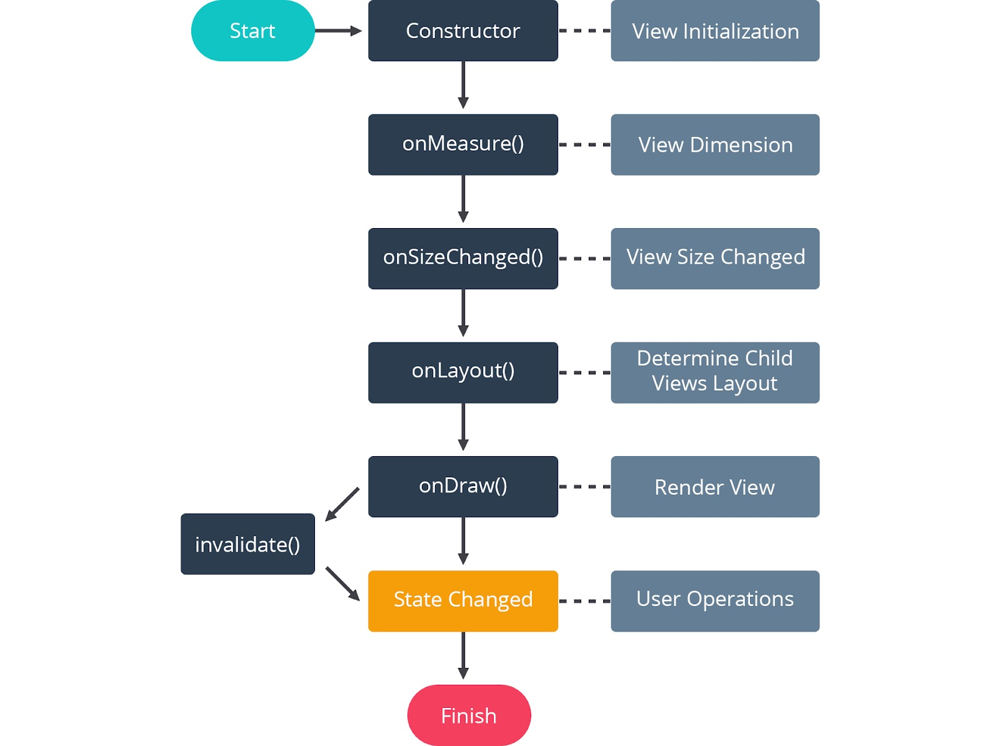
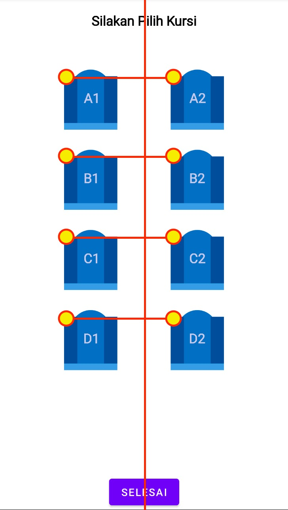

# Alur memesan Kursi

1. membuatnya Data Class Seat untuk menampung informasi kursi, seperti id, nama, apakah sudah di booking, posisi x, posisi y
2. membuat variabel array seats yang menyimpan kumpulan informasi yang ada
3. menyediakan informasi umum seperti id, nama, dan status booking ketika SeatView diinsialisasi
4. melengkapi informasi seperti posisi x dan y melalui metode onMeasure
5. menggambar kursi berdasarkan informasi kursi yang didaptkan melalui metode onDraw
6. menambahkan fungsionalistasonTouch untuk setiap kursi yang tampil di layar
7. jika kursi ditekan, informasi booking pada kursi sebelumnya akan dihapus
8. informasi kursi (seat) yang telah dibooing bisa oleh siap saja selama data tersebut valid (non-null)

# Lifecycle Custom View

- Start: Sebuha Custom View telah siap untuk dipanggil dalam sebuah tampilan
- ViewInitialize: proses terjadinya insialisasi dimensi (baik lebar atau pnjang) dari sebuah custom view melalui metode onMeasure(). selain itu kita juga menetapkan dimensi dari masing masing object yang akan digambar dalam canvas
- View Dimension: digunakan untuk mendefinsikan perubaha yang terjadi. jika cutom view yang telah didefinsikan terdapat perubahan sewaktu waktum anda dapat memperbarui dimensi dari masing masing object melalui metode onSizeChanged
- View size changed: Digunakan untuk mendefinisikan perubahan yang terjadi. Jika Custom View yang telah didefinisikan terdapat perubahan sewaktu-waktu, Anda dapat memperbarui dimensi dari masing-masing object melalui metode onSizeChanged.
- Determine child view layout : Digunakan untuk menentukan mengatur view lain yang akan ditampilkan dalam Custom View melalui metode onLayout.
- RenderView : Digunakan untuk menggambar object ke dalam Canvas melalui metode onDraw.
- User Operation : Proses interaksi pengguna dengan Custom View. Anda dapat memanggil fungsi invalidate untuk memperbarui status yang diberikan pengguna. 
- Finish : Proses akhir dari sebuah Custom View. Biasanya proses tersebut terjadi Custom View berada dalam Activity atau Fragment yang akan berakhir.

# perisapan Data Seat

private val seats: ArrayList<Seat> = arrayListOf(
Seat(id = 1, name = "A1", isBooked = false),
Seat(id = 2, name = "A2", isBooked = false),
Seat(id = 3, name = "B1", isBooked = false),
Seat(id = 4, name = "A4", isBooked = false),
Seat(id = 5, name = "C1", isBooked = false),
Seat(id = 6, name = "C2", isBooked = false),
Seat(id = 7, name = "D1", isBooked = false),
Seat(id = 8, name = "D2", isBooked = false),
)

# onMeasure
kita menggunakan onMeasure untuk menentukan posisi X dan Y dari masing kursi yang kosong tersebut

jadi dalam proses onMeasure, kita menentukan beberapa titik x dan y dari masing masing kursi. setelah menentukan titiknya, kita dapat mulai menggambar masing masing kursi

# onDraw
dalam metode onDraw, terdaapt sebuah canvas yang bisa langsung kita gunakan untuk menggambar. karena terdapat 8 kursi yang sama, kita cukup melakukan perulangan saja. hal terpentingnya adalah kita dapat mengetahio posisi x dan y dari masing masing kursi

# onTouchEvent
jika diperhatikan, metode onTouchEvent memang tidak tersedia dalam flow. namun, sebernatnya bagian ini masuk dalam operasi pengguna. kita bisa mengatur gestur pengguna ketika mengguinakan apl;ikasi, seperti ketika menyentuhkan jarinya ke layar maupun ketika mengankatnya

